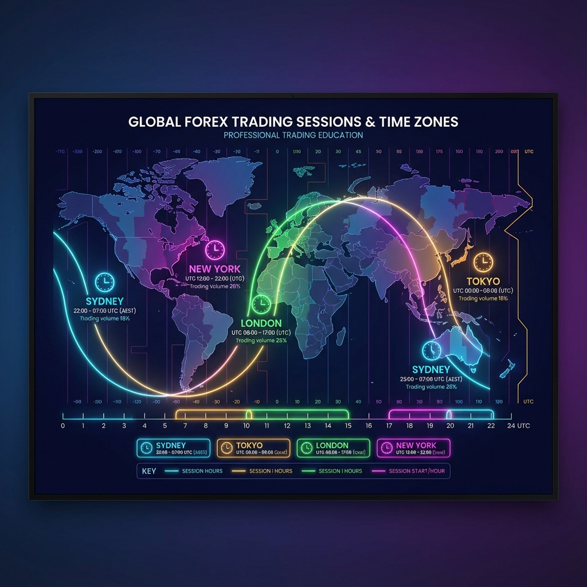

# CHƯƠNG 1: TỔNG QUAN VỀ THỊ TRƯỜNG FOREX



---

## 1. Forex là gì?

**Forex** (viết tắt của **Foreign Exchange**) hay còn gọi là thị trường ngoại hối, là thị trường tài chính lớn nhất và có tính thanh khoản cao nhất trên thế giới.

### Những con số ấn tượng:
| Chỉ số | Giá trị |
|--------|---------|
| Khối lượng giao dịch hàng ngày | **> 7.5 nghìn tỷ USD** |
| Hoạt động | **24 giờ/ngày, 5 ngày/tuần** |
| Số lượng cặp tiền tệ | **Hơn 100 cặp** |

### Tại sao gọi là "Ngoại hối"?
Vì bản chất của thị trường này là **trao đổi (exchange)** giữa các loại **tiền tệ nước ngoài (foreign currencies)**. Ví dụ: Bạn đổi Euro sang Đô la Mỹ, hay đổi Yên Nhật sang Bảng Anh.

---

## 2. Các thành phần tham gia thị trường

Thị trường Forex không có một sàn giao dịch tập trung như chứng khoán. Nó hoạt động theo mô hình **OTC (Over-the-Counter)** - giao dịch phi tập trung.

### Các "người chơi" chính:

| Thành phần | Vai trò |
|------------|---------|
| **Ngân hàng Trung ương** | Điều tiết chính sách tiền tệ, can thiệp tỷ giá |
| **Ngân hàng Thương mại** | Giao dịch khối lượng lớn cho khách hàng và tự doanh |
| **Quỹ đầu tư (Hedge Funds)** | Đầu cơ để kiếm lợi nhuận từ biến động tỷ giá |
| **Công ty đa quốc gia** | Đổi tiền cho hoạt động kinh doanh quốc tế |
| **Nhà giao dịch cá nhân (Retail Traders)** | Chúng ta - những người giao dịch thông qua các sàn môi giới |

> ⚠️ **Lưu ý quan trọng:** Retail Traders chỉ chiếm khoảng **5-6%** tổng khối lượng giao dịch. Phần lớn là các tổ chức lớn (Smart Money).

---

## 3. Cách thức thị trường vận hành

### Giao dịch theo cặp (Currency Pairs)
Trong Forex, bạn luôn giao dịch **một cặp tiền tệ**. Ví dụ: **EUR/USD**

```
EUR/USD = 1.1000
```

**Giải thích:**
- **EUR (Euro)** = Đồng tiền cơ sở (Base Currency)
- **USD (US Dollar)** = Đồng tiền định giá (Quote Currency)
- **1.1000** = Cần 1.1000 USD để mua 1 EUR

### Khi bạn MUA (Buy/Long):
- Bạn **mua đồng tiền cơ sở** (EUR)
- Bạn **bán đồng tiền định giá** (USD)
- Bạn kỳ vọng EUR sẽ **tăng giá** so với USD

### Khi bạn BÁN (Sell/Short):
- Bạn **bán đồng tiền cơ sở** (EUR)
- Bạn **mua đồng tiền định giá** (USD)
- Bạn kỳ vọng EUR sẽ **giảm giá** so với USD

---

## 4. Thời gian giao dịch (Trading Sessions)

Thị trường hoạt động **24 giờ một ngày**, từ **Thứ 2 đến Thứ 6** (tính theo giờ Việt Nam).

### Bảng thời gian các phiên giao dịch (Giờ Việt Nam - GMT+7):

| Phiên | Thời gian | Đặc điểm |
|-------|-----------|----------|
| 🇦🇺 **Sydney** | 05:00 - 14:00 | Khởi đầu tuần giao dịch, thanh khoản thấp |
| 🇯🇵 **Tokyo** | 06:00 - 15:00 | Cặp tiền JPY biến động mạnh |
| 🇬🇧 **London** | 14:00 - 23:00 | Phiên sôi động nhất, thanh khoản cao nhất |
| 🇺🇸 **New York** | 19:00 - 04:00 | Tin tức Mỹ, biến động mạnh |

### Khung giờ vàng:
> 🔥 **19:00 - 23:00 (Giờ VN)** là thời điểm phiên London và New York **giao nhau**. Đây là lúc thị trường có thanh khoản và biến động mạnh nhất trong ngày.

> ⏰ **Lưu ý:** Giờ các phiên có thể lệch khoảng **1 giờ** vào một số giai đoạn do **Daylight Saving Time (DST)** ở London/New York. Khi thực chiến, hãy đối chiếu theo **lịch kinh tế** hoặc **giờ server của sàn**.

---

## 5. Lợi ích và Rủi ro khi giao dịch Forex

### ✅ Lợi ích:

| Lợi ích | Giải thích |
|---------|------------|
| **Thanh khoản cao** | Luôn có người mua và bán, lệnh được khớp ngay lập tức |
| **Đòn bẩy cao** | Có thể kiểm soát số tiền lớn với vốn nhỏ (1:100, 1:500...) |
| **Giao dịch hai chiều** | Kiếm tiền cả khi giá tăng (Buy) lẫn giá giảm (Sell) |
| **Chi phí thấp** | Spread nhỏ, không phí hoa hồng (với nhiều sàn) |
| **Linh hoạt thời gian** | Giao dịch 24/5, phù hợp mọi lịch trình |

### ❌ Rủi ro:

| Rủi ro | Giải thích |
|--------|------------|
| **Đòn bẩy là con dao hai lưỡi** | Lợi nhuận x100, nhưng thua lỗ cũng x100 |
| **Biến động không lường trước** | Tin tức bất ngờ có thể khiến giá bay hàng trăm pips |
| **Tâm lý dễ bị ảnh hưởng** | FOMO, sợ hãi, tham lam dẫn đến quyết định sai lầm |
| **Sàn không uy tín** | Có những sàn lừa đảo, không rút được tiền |

---

## 6. Những yếu tố ảnh hưởng đến tỷ giá

Tỷ giá biến động liên tục vì cung/cầu của mỗi đồng tiền thay đổi theo bối cảnh kinh tế và kỳ vọng của thị trường.

### Các yếu tố thường gặp:

| Nhóm yếu tố | Ví dụ | Tác động phổ biến |
|------------|-------|-------------------|
| **Lãi suất & chính sách tiền tệ** | Quyết định lãi suất, phát biểu NHTW | Thường là yếu tố mạnh nhất trong dài hạn |
| **Dữ liệu kinh tế** | CPI, GDP, NFP, PMI | Tạo biến động mạnh tại thời điểm công bố |
| **Tin tức/địa chính trị** | Xung đột, bầu cử, khủng hoảng | Có thể gây biến động bất ngờ, khó lường |
| **Tâm lý thị trường** | Risk-on / Risk-off | Dòng tiền dịch chuyển sang tài sản trú ẩn/rủi ro |

> 💡 Gợi ý: Khi có tin mạnh, spread/biến động có thể tăng nhanh. Người mới nên quan sát trên Demo trước.

---

## 7. Vì sao “phiên giao dịch” quan trọng?

Không phải thời điểm nào thị trường cũng sôi động như nhau:
- **Phiên London & New York:** thường có **thanh khoản cao**, biến động rõ rệt hơn.
- **Phiên Tokyo:** thường ổn định hơn, nhưng các cặp liên quan **JPY** có thể biến động mạnh.
- **Giai đoạn ít thanh khoản:** dễ gặp spread nới rộng và biến động “giật” hơn.

---

## 8. Cách bắt đầu đúng cho người mới

1. Học nền tảng chương 1 → chương 2 (thuật ngữ, pip/lot, lệnh...).
2. Dùng **tài khoản Demo** ít nhất 2–4 tuần để luyện thao tác và quan sát phiên.
3. Chỉ theo dõi **1–2 cặp chính** (ví dụ EUR/USD, GBP/USD) để tránh quá tải.
4. Ghi lại nhận xét/nhật ký quan sát (giờ nào biến động mạnh, tin nào ảnh hưởng rõ).
5. Ưu tiên bảo vệ vốn và kỷ luật; phần quản lý rủi ro sẽ học sâu ở **Chương 4**.

---

## 📝 Bài tập Chương 1

1. **Câu hỏi:** Nếu bạn mua cặp GBP/USD, bạn đang kỳ vọng điều gì?
2. **Câu hỏi:** Khung giờ nào trong ngày có thanh khoản cao nhất (theo giờ Việt Nam)?
3. **Thực hành:** Mở một tài khoản Demo miễn phí trên sàn uy tín (Exness, XM, IC Markets...) và quan sát biến động giá.
4. **Câu hỏi:** Trong cặp EUR/USD, đâu là đồng tiền cơ sở (base) và đâu là đồng tiền định giá (quote)?
5. **Câu hỏi:** Nếu EUR/USD = 1.1000, điều này có nghĩa là gì?
6. **Câu hỏi:** Forex hoạt động theo mô hình OTC là gì? Khác gì so với thị trường chứng khoán có sàn tập trung?
7. **Câu hỏi:** Kể tên ít nhất 3 nhóm tham gia thị trường Forex và vai trò chính của họ.
8. **Câu hỏi:** Retail Traders chiếm khoảng bao nhiêu % tổng khối lượng giao dịch? Điều này gợi ý điều gì về “ai” tác động lớn đến thị trường?
9. **Câu hỏi:** Phiên nào thường có thanh khoản cao nhất? Khung giờ giao nhau London–New York (giờ VN) là mấy giờ?
10. **Câu hỏi:** Nêu 3 lợi ích và 3 rủi ro khi giao dịch Forex theo nội dung chương 1.
11. **Câu hỏi:** Kể tên 3 yếu tố thường ảnh hưởng đến tỷ giá Forex.
12. **Câu hỏi:** Vì sao giờ các phiên có thể lệch khoảng 1 giờ ở một số giai đoạn trong năm?

## ✅ Đáp án gợi ý (Chương 1)

1. **Đáp án:** Bạn đang **mua GBP** và **bán USD**, kỳ vọng **GBP mạnh lên so với USD** → **GBP/USD tăng**.
2. **Đáp án:** Khung giờ thường thanh khoản/biến động mạnh nhất là **19:00–23:00 (giờ VN)** khi **London giao nhau với New York**.
3. **Gợi ý thực hành:** Tạo tài khoản **Demo**, mở biểu đồ một vài cặp chính (ví dụ: EUR/USD, GBP/USD), quan sát giá ở các khung giờ khác nhau (đặc biệt 19:00–23:00) và ghi lại nhận xét về mức độ biến động/spread.
4. **Đáp án:** **EUR/USD**: **EUR** là **base**, **USD** là **quote**.
5. **Đáp án:** **EUR/USD = 1.1000** nghĩa là cần **1.1000 USD để mua 1 EUR**.
6. **Đáp án:** **OTC (Over-the-Counter)** là thị trường **phi tập trung**, giao dịch qua mạng lưới các bên tham gia (ngân hàng, tổ chức, broker) thay vì một sàn duy nhất. Chứng khoán có **sàn tập trung** (exchange) với cơ chế khớp lệnh và niêm yết tập trung.
7. **Đáp án (ví dụ):**
   - **Ngân hàng Trung ương:** điều tiết chính sách tiền tệ, can thiệp tỷ giá.
   - **Ngân hàng thương mại:** giao dịch khối lượng lớn cho khách hàng và tự doanh.
   - **Quỹ đầu tư/Hedge funds:** đầu cơ, tìm lợi nhuận từ biến động tỷ giá.
   - **Công ty đa quốc gia:** đổi tiền phục vụ hoạt động kinh doanh quốc tế.
   - **Retail traders:** giao dịch qua broker với quy mô nhỏ.
8. **Đáp án:** Khoảng **5–6%**. Điều này gợi ý phần lớn thanh khoản/ảnh hưởng đến giá đến từ **tổ chức lớn (smart money)**.
9. **Đáp án:** **London** thường là phiên sôi động nhất; khung giờ giao nhau **London–New York** (giờ VN) là **19:00–23:00**.
10. **Đáp án (theo chương 1):**
   - **Lợi ích:** thanh khoản cao; đòn bẩy cao; giao dịch hai chiều; chi phí thấp; linh hoạt thời gian.
   - **Rủi ro:** đòn bẩy là con dao hai lưỡi; biến động do tin tức; tâm lý (FOMO/sợ hãi/tham lam); rủi ro sàn không uy tín.
11. **Đáp án (ví dụ):** lãi suất/chính sách tiền tệ; dữ liệu kinh tế (CPI, GDP, NFP...); tin tức/địa chính trị; tâm lý thị trường (risk-on/off).
12. **Đáp án:** Do **Daylight Saving Time (DST)** ở London/New York (giờ mùa hè/mùa đông) khiến khung giờ phiên có thể thay đổi khoảng **1 giờ** tùy giai đoạn.

---

**[⬅️ Quay lại Mục lục](./README.md)** | **[Chương tiếp theo: Kiến thức Cơ bản ➡️](./chuong_2_co_ban.md)**
