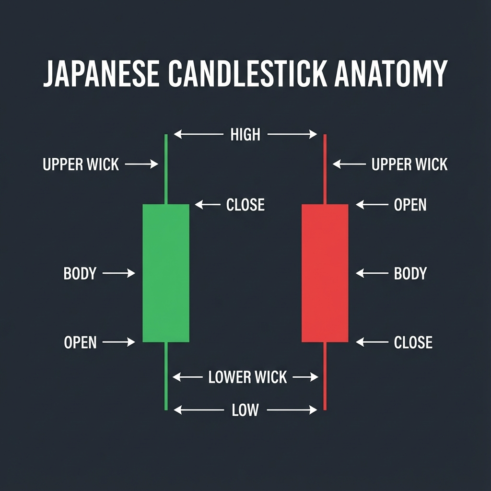
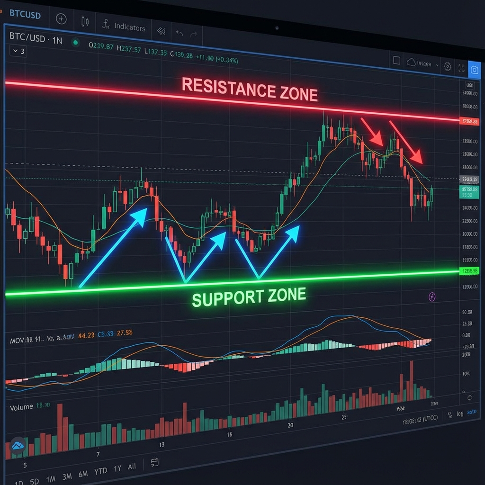

# CHƯƠNG 3: PHÂN TÍCH KỸ THUẬT (NỀN TẢNG)



---

## 1. Tổng quan về Phân tích Kỹ thuật

**Phân tích kỹ thuật (Technical Analysis - TA)** là phương pháp dự đoán xu hướng giá trong tương lai dựa trên việc nghiên cứu **dữ liệu giá trong quá khứ**.

### Ba nguyên tắc cơ bản:

| Nguyên tắc | Giải thích |
|------------|------------|
| **Giá phản ánh tất cả** | Mọi thông tin (tin tức, tâm lý, cung cầu) đều được thể hiện trong giá |
| **Giá di chuyển theo xu hướng** | Giá có xu hướng tiếp tục di chuyển theo một hướng cho đến khi có dấu hiệu đảo chiều |
| **Lịch sử có xu hướng lặp lại** | Các mô hình giá trong quá khứ thường lặp lại trong tương lai |

---

## 2. Biểu đồ nến Nhật (Japanese Candlesticks)

Biểu đồ nến Nhật là công cụ phổ biến nhất để đọc và phân tích biến động giá.

### Cấu tạo một cây nến:

| Thành phần | Mô tả |
|------------|-------|
| **Thân nến (Body)** | Khoảng cách giữa giá mở cửa và đóng cửa |
| **Râu trên (Upper Wick/Shadow)** | Giá cao nhất trong phiên |
| **Râu dưới (Lower Wick/Shadow)** | Giá thấp nhất trong phiên |

### Hai loại nến cơ bản:

| Loại nến | Đặc điểm | Ý nghĩa |
|----------|----------|---------|
| 🟢 **Nến tăng (Bullish)** | Giá đóng cửa > Giá mở cửa | Lực mua mạnh hơn lực bán |
| 🔴 **Nến giảm (Bearish)** | Giá đóng cửa < Giá mở cửa | Lực bán mạnh hơn lực mua |

### Cách đọc “ngôn ngữ” nến (quan trọng)

| Dấu hiệu | Hàm ý thường gặp |
|---------|-------------------|
| **Thân nến dài** | Động lượng (momentum) mạnh theo hướng đóng cửa |
| **Râu dưới dài** | Bị từ chối giá thấp (lực mua đẩy lên) |
| **Râu trên dài** | Bị từ chối giá cao (lực bán đẩy xuống) |
| **Đóng cửa gần đỉnh/đáy nến** | Bên thắng thế kiểm soát đến cuối phiên |

> 💡 Nguyên tắc: Mô hình nến có ý nghĩa nhất khi xuất hiện tại **vùng S/R**, **trendline**, hoặc sau một nhịp giá chạy mạnh (có bối cảnh).

### Các mô hình nến quan trọng:

#### 🔹 Nến đơn (Single Candlestick Patterns)

| Mô hình | Hình dạng | Ý nghĩa |
|---------|-----------|---------|
| **Doji** | Thân rất nhỏ, râu dài | Thị trường do dự, có thể đảo chiều |
| **Hammer** | Thân nhỏ phía trên, râu dưới dài | Tín hiệu đảo chiều tăng (ở đáy) |
| **Inverted Hammer** | Thân nhỏ phía dưới, râu trên dài | Tín hiệu đảo chiều tăng (ở đáy) |
| **Hanging Man** | Giống Hammer nhưng ở đỉnh | Tín hiệu đảo chiều giảm |
| **Shooting Star** | Giống Inverted Hammer nhưng ở đỉnh | Tín hiệu đảo chiều giảm |
| **Marubozu** | Thân dài, không có râu | Momentum rất mạnh theo hướng nến |

#### 🔸 Nến đôi & đa nến (Multi-Candlestick Patterns)

| Mô hình | Cấu tạo | Ý nghĩa |
|---------|---------|---------|
| **Engulfing** | Nến sau "nuốt" hoàn toàn nến trước | Tín hiệu đảo chiều mạnh |
| **Tweezer Top/Bottom** | 2 nến có đỉnh/đáy bằng nhau | Vùng kháng cự/hỗ trợ mạnh |
| **Morning Star** | 3 nến: giảm → doji → tăng | Đảo chiều từ giảm sang tăng |
| **Evening Star** | 3 nến: tăng → doji → giảm | Đảo chiều từ tăng sang giảm |

### Sai lầm phổ biến khi dùng mô hình nến
- Chỉ nhìn 1–2 cây nến mà bỏ qua **xu hướng** và **vùng giá**.
- Vào lệnh trước khi nến **đóng cửa** (dễ bị “đảo” trong phiên).
- Không đặt **Stop Loss** vì “cây nến đẹp”.

---

## 3. Hỗ trợ (Support) và Kháng cự (Resistance)



### Định nghĩa:

| Khái niệm | Mô tả |
|-----------|-------|
| **Hỗ trợ (Support)** | Vùng giá mà lực mua đủ mạnh để ngăn giá giảm thêm |
| **Kháng cự (Resistance)** | Vùng giá mà lực bán đủ mạnh để ngăn giá tăng thêm |

### Nguyên tắc quan trọng:

> 💡 **Khi hỗ trợ bị phá vỡ, nó trở thành kháng cự.**
> **Khi kháng cự bị phá vỡ, nó trở thành hỗ trợ.**

### Cách xác định vùng Support/Resistance:

1. **Swing High/Low**: Các đỉnh và đáy rõ ràng trên biểu đồ
2. **Vùng tâm lý**: Các mức giá tròn (1.1000, 1.2000, 2000.00...)
3. **Khối lượng cao**: Vùng có hoạt động giao dịch lớn trong quá khứ

### Vẽ “vùng” thay vì “một đường”
Thực tế giá hiếm khi đảo đúng một mức giá duy nhất. Người mới nên đánh **zone** (một dải giá) dựa trên:
- Cụm nến đảo chiều / nhiều lần chạm
- Râu nến quét qua nhưng thân nến đóng cửa vẫn tôn trọng vùng

### Break & Retest (phá vỡ và hồi kiểm tra)
Một kịch bản phổ biến:
1. Giá **break** qua kháng cự (hoặc hỗ trợ) với nến đóng cửa rõ ràng
2. Giá **retest** lại vùng vừa phá
3. Nếu vùng giữ vững, khả năng tiếp diễn cao hơn

> ⚠️ Lưu ý: Break yếu dễ thành **false breakout** (phá vỡ giả), đặc biệt khi thanh khoản thấp hoặc ngay trước tin mạnh.

### Ví dụ thực tế:

```
EUR/USD
- Kháng cự mạnh: 1.1050 (giá đã chạm 3 lần và bật xuống)
- Hỗ trợ mạnh: 1.0900 (giá đã chạm 2 lần và bật lên)

Chiến lược: Buy gần 1.0900, đặt SL dưới 1.0850, TP tại 1.1050
```

---

## 4.1. Cấu trúc thị trường (Market Structure)

Đây là cách “đọc” xu hướng bằng **chuỗi swing** (đỉnh/đáy):
- **Uptrend:** HH/HL (đỉnh sau cao hơn, đáy sau cao hơn)
- **Downtrend:** LH/LL (đỉnh sau thấp hơn, đáy sau thấp hơn)

### Dấu hiệu xu hướng yếu đi / có thể đổi chiều
- Không tạo được HH mới trong uptrend (bắt đầu tạo **LH**)
- Hỗ trợ quan trọng bị phá (đóng cửa dưới vùng)
- Giá phá qua swing quan trọng theo hướng ngược lại

> 💡 Mục tiêu của phần này là đọc xu hướng “mạch lạc”, chưa cần thuật ngữ nâng cao; chương chiến lược sẽ khai thác sâu hơn.

## 4. Xu hướng (Trend)

### Ba loại xu hướng:

| Loại | Đặc điểm | Chiến lược |
|------|----------|------------|
| **Uptrend (Tăng)** | Đỉnh sau cao hơn đỉnh trước (HH), Đáy sau cao hơn đáy trước (HL) | Ưu tiên BUY |
| **Downtrend (Giảm)** | Đỉnh sau thấp hơn đỉnh trước (LH), Đáy sau thấp hơn đáy trước (LL) | Ưu tiên SELL |
| **Sideways (Đi ngang)** | Giá dao động trong một biên độ | Mua ở support, bán ở resistance |

### Ký hiệu quan trọng:
- **HH** = Higher High (Đỉnh cao hơn)
- **HL** = Higher Low (Đáy cao hơn)
- **LH** = Lower High (Đỉnh thấp hơn)
- **LL** = Lower Low (Đáy thấp hơn)

### Nguyên tắc giao dịch theo xu hướng:

> 📌 **"Trend is your friend"** - Xu hướng là bạn của bạn.
> 
> Luôn giao dịch **theo xu hướng** chứ không chống lại nó.

---

## 5. Đường xu hướng (Trendlines)

### Cách vẽ Trendline:

| Loại | Cách vẽ |
|------|---------|
| **Trendline tăng** | Nối các đáy (HL) lại với nhau |
| **Trendline giảm** | Nối các đỉnh (LH) lại với nhau |

### Quy tắc vẽ Trendline hợp lệ:

1. **Tối thiểu 2 điểm chạm** (3 điểm chạm = trendline mạnh)
2. **Không cắt qua thân nến**
3. **Góc nghiêng hợp lý** (không quá dốc, không quá ngang)

### Sử dụng Trendline:

| Hành động | Khi nào |
|-----------|---------|
| **Buy** | Giá chạm trendline tăng và có tín hiệu bật lên |
| **Sell** | Giá chạm trendline giảm và có tín hiệu bật xuống |
| **Breakout** | Khi giá phá vỡ trendline = có thể đảo chiều |

---

## 6. Các khung thời gian (Timeframes)

### Bảng phân loại Timeframes:

| Nhóm | Timeframes | Phù hợp với |
|------|------------|-------------|
| **Ngắn hạn** | M1, M5, M15 | Scalping |
| **Trung hạn** | M30, H1, H4 | Day Trading, Swing Trading |
| **Dài hạn** | D1, W1, MN | Position Trading |

### Phân tích đa khung thời gian (Multi-Timeframe Analysis):

> 🔑 **Quy tắc vàng**: Phân tích xu hướng ở khung lớn, vào lệnh ở khung nhỏ.

**Ví dụ:**
1. **H4**: Xác định xu hướng chính là TĂNG
2. **H1**: Tìm vùng pullback (giá hồi về)
3. **M15**: Tìm tín hiệu vào lệnh BUY (nến đảo chiều, price action...)

### Gợi ý cấu trúc phân tích top-down (dễ áp dụng)
1. **D1/H4:** đánh dấu xu hướng & vùng S/R quan trọng
2. **H1/M30:** chờ giá về vùng (pullback) và quan sát phản ứng
3. **M15/M5:** chỉ tìm điểm vào khi có tín hiệu rõ ràng, luôn có SL

---

## 7. Các mô hình giá (Chart Patterns)

### Mô hình đảo chiều (Reversal Patterns):

| Mô hình | Xuất hiện | Tín hiệu |
|---------|-----------|----------|
| **Head and Shoulders** | Sau uptrend | Đảo chiều giảm |
| **Inverse Head and Shoulders** | Sau downtrend | Đảo chiều tăng |
| **Double Top** | Sau uptrend | Đảo chiều giảm |
| **Double Bottom** | Sau downtrend | Đảo chiều tăng |
| **Triple Top/Bottom** | - | Mạnh hơn Double Top/Bottom |

### Mô hình tiếp diễn (Continuation Patterns):

| Mô hình | Đặc điểm | Giao dịch |
|---------|----------|-----------|
| **Flag / Pennant** | Nghỉ ngắn trong xu hướng mạnh | Trade theo hướng breakout |
| **Triangle** (Ascending, Descending, Symmetrical) | Giá co hẹp dần | Chờ breakout |
| **Rectangle** | Giá đi ngang trong range | Trade breakout hoặc trong range |

### Cách trade mô hình giá (nguyên tắc chung)
- **Xác nhận:** ưu tiên nến **đóng cửa** phá vỡ vùng/mẫu hình
- **SL:** đặt sau vùng invalidation (sau swing/đỉnh/đáy gần nhất hoặc ngoài biên mô hình)
- **TP:** dùng mục tiêu “đo chiều cao” (measured move) hoặc về vùng S/R tiếp theo

---

## 📝 Bài tập Chương 3

1. **Nhận diện**: Mở biểu đồ EUR/USD H4, tìm các mẫu nến Doji và Engulfing trong 2 tuần gần nhất.
2. **Vẽ Trendline**: Vẽ trendline hợp lệ trên biểu đồ GBP/USD D1.
3. **Xác định S/R**: Tìm 3 vùng hỗ trợ và 3 vùng kháng cự quan trọng trên XAU/USD H4.
4. **Multi-timeframe**: Chọn một cặp tiền, xác định xu hướng trên D1/H4, sau đó chuyển xuống H1 để tìm vùng pullback hợp lý.
5. **Break & Retest**: Tìm một ví dụ phá vỡ hỗ trợ/kháng cự và hồi kiểm tra lại (retest). Ghi chú điều gì khiến bạn tin đó là break thật hay break giả.
6. **Cấu trúc thị trường**: Nhìn 20–50 cây nến gần nhất trên H4, bạn đang thấy HH/HL hay LH/LL? Kết luận xu hướng chính là gì?
7. **Nến & bối cảnh**: Tìm một cây nến có **râu dưới dài** tại vùng hỗ trợ. Bạn kỳ vọng điều gì sẽ xảy ra tiếp theo? Điều kiện nào khiến ý tưởng này bị sai?
8. **Trendline hợp lệ**: Nêu 3 tiêu chí để một trendline được xem là “hợp lệ”.
9. **Chart pattern**: Tìm một mô hình (Triangle/Flag/Rectangle) trên H1 hoặc H4. Đánh dấu điểm phá vỡ (breakout), vị trí SL hợp lý và mục tiêu TP.
10. **Kế hoạch vào lệnh (mô phỏng)**: Chọn một vùng S/R quan trọng và viết 3 gạch đầu dòng: điều kiện vào lệnh, SL đặt ở đâu, TP đặt ở đâu.

## ✅ Đáp án gợi ý (Chương 3)

> Lưu ý: Chương 3 thiên về **kỹ năng quan sát**. “Đáp án” dưới đây là tiêu chí/khung trả lời để bạn tự kiểm tra lại bài làm.

1. **Gợi ý đáp án:** Doji = thân nhỏ, thể hiện do dự; Engulfing = nến sau “nuốt” nến trước. Ưu tiên đánh dấu khi chúng xuất hiện tại vùng S/R hoặc sau nhịp chạy mạnh.
2. **Gợi ý đáp án:** Trendline hợp lệ thường có tối thiểu **2 điểm chạm** (3 điểm càng tốt), không cắt qua thân nến, góc hợp lý và được giá phản ứng nhiều lần.
3. **Gợi ý đáp án:** Vùng S/R mạnh thường là nơi có nhiều lần chạm/đảo chiều, gần mức tròn/tâm lý, hoặc tạo phản ứng rõ (nến từ chối, break & retest).
4. **Gợi ý đáp án:** D1/H4 xác định xu hướng + vùng quan trọng; H1 chờ pullback về vùng; khung nhỏ hơn chỉ vào khi có tín hiệu rõ và có SL.
5. **Gợi ý đáp án:** Break thật thường có nến **đóng cửa** vượt vùng rõ ràng, sau đó retest giữ vững; break giả hay có râu quét rồi đóng cửa trở lại trong vùng (đặc biệt khi thanh khoản thấp/trước tin).
6. **Gợi ý đáp án:** HH/HL ⇒ uptrend; LH/LL ⇒ downtrend; nếu xen kẽ và biên rõ ⇒ sideways/range. Ưu tiên giao dịch theo hướng cấu trúc chính.
7. **Gợi ý đáp án:** Râu dưới dài tại hỗ trợ thường hàm ý bị từ chối giá thấp ⇒ kỳ vọng bật lên/pullback kết thúc. Ý tưởng sai khi giá đóng cửa phá thủng vùng hỗ trợ hoặc tạo LL mới rõ ràng.
8. **Đáp án:** (1) ≥ 2 điểm chạm (3 điểm càng mạnh), (2) không cắt qua thân nến, (3) góc nghiêng hợp lý/được giá phản ứng nhiều lần.
9. **Gợi ý đáp án:** Xác nhận breakout bằng nến đóng cửa; SL đặt ngoài biên mô hình hoặc sau swing gần nhất; TP theo measured move hoặc vùng S/R kế tiếp.
10. **Gợi ý đáp án:** Điều kiện vào lệnh dựa trên phản ứng tại vùng (từ chối giá/đóng cửa xác nhận); SL đặt tại điểm invalidation (ngoài vùng/sau swing); TP về vùng đối diện hoặc theo RR tối thiểu (ví dụ 1:2).

---

**[⬅️ Chương trước](./chuong_2_co_ban.md)** | **[Mục lục](./README.md)** | **[Chương tiếp theo ➡️](./chuong_4_quan_ly_rui_ro.md)**
