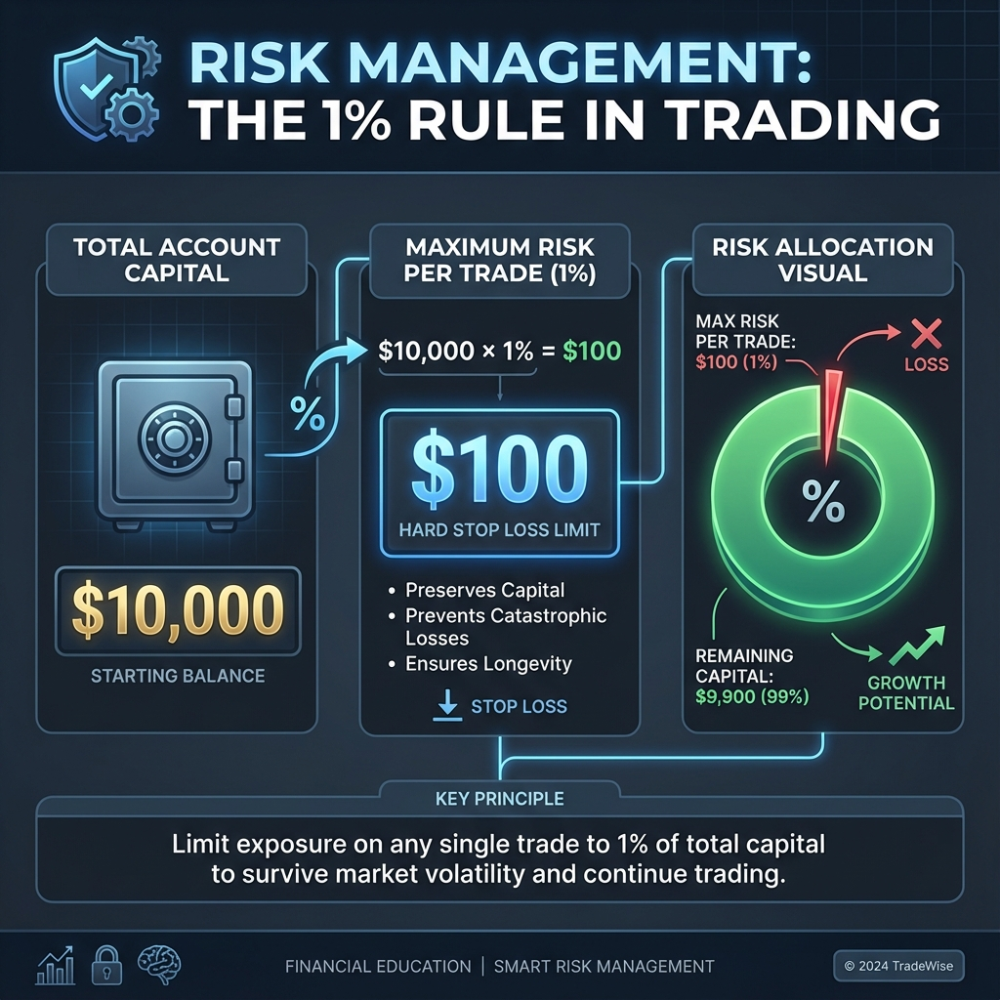

# CHƯƠNG 4: QUẢN LÝ RỦI RO & TÂM LÝ GIAO DỊCH



---

## 1. Tại sao Quản lý Rủi ro là QUAN TRỌNG NHẤT?

> 💀 **Sự thật:** 90% trader thua lỗ, và nguyên nhân #1 là **KHÔNG QUẢN LÝ RỦI RO**.

### Công thức thành công:
```
Chiến lược tốt + Quản lý rủi ro kém = THUA
Chiến lược trung bình + Quản lý rủi ro tốt = THẮNG
```

---

## 2. Quy tắc 1-2% (The 1-2% Rule)

> 🔐 **KHÔNG BAO GIỜ RỦI RO QUÁ 1-2% TÀI KHOẢN CHO MỘT LỆNH**

| Vốn | 1% rủi ro | 2% rủi ro |
|-----|-----------|-----------|
| $1,000 | $10 | $20 |
| $10,000 | $100 | $200 |
| $100,000 | $1,000 | $2,000 |

### Rủi ro “mỗi lệnh” là gì?
Rủi ro mỗi lệnh = **số tiền bạn mất nếu Stop Loss bị hit** (đã tính spread/commission/slippage).

> 💡 Mục tiêu: thua 1 lệnh vẫn “nhẹ”, không ảnh hưởng tâm lý và không phá hỏng tài khoản.

---

## 3. Cách tính Lot Size

```
Lot Size = (Số tiền rủi ro) / (SL pips × Giá trị 1 pip)
```

**Ví dụ:** Tài khoản $10,000, rủi ro 1% = $100, SL 50 pips
```
Lot = $100 / (50 × $10) = 0.2 lot
```

### Chọn Stop Loss đúng cách (đừng đặt ngẫu nhiên)
- SL nên đặt ở vị trí **invalidate ý tưởng** (sau swing high/low, ngoài vùng S/R, ngoài trendline…).
- **SL càng xa → lot càng nhỏ** (đúng nguyên tắc), thay vì giữ lot và “nới” SL.

### Tránh “rủi ro chồng rủi ro” (correlation)
Nếu bạn vào nhiều lệnh cùng lúc mà đều phụ thuộc vào **sức mạnh USD** (ví dụ EUR/USD và GBP/USD), hãy coi đó gần như là **một ý tưởng**:
- Giảm rủi ro mỗi lệnh, hoặc
- Chỉ chọn 1 setup tốt nhất

---

## 4. Tỷ lệ Risk/Reward (R:R)

| R:R | Cần win rate |
|-----|--------------|
| 1:1 | 50% để hòa vốn |
| 1:2 | 34% để hòa vốn |
| 1:3 | 25% để hòa vốn |

> 💡 **Quy tắc:** Tối thiểu R:R = 1:2

### R (R-multiple) và kỳ vọng (Expectancy)
- **1R** = mức thua tối đa theo SL (đúng số tiền rủi ro đã định).
- Kết quả mỗi lệnh nên được ghi theo **R**: -1R, +2R, +3R...

Kỳ vọng đơn giản:
```
Expectancy (R) = (WinRate × AvgWinR) - (LossRate × AvgLossR)
```

> 💡 Một hệ thống win rate không cao vẫn có thể có lãi nếu AvgWinR đủ lớn và bạn giữ kỷ luật.

### Lưu ý về “hòa vốn”
Bảng win rate ở trên là lý thuyết, thực tế còn có **spread/commission/slippage**, nên điểm hòa vốn thường cao hơn một chút.

---

## 5. Tâm lý Giao dịch

| Vấn đề | Giải pháp |
|--------|-----------|
| **FOMO** | "Thị trường luôn có cơ hội mới" |
| **Revenge Trading** | Nghỉ 1 ngày sau 2-3 lệnh thua |
| **Tham lam** | Tuân thủ TP đã đặt |
| **Sợ hãi** | Tin tưởng hệ thống |

### “Luật an toàn” để bảo vệ tâm lý
- **Giới hạn lỗ theo ngày**: dừng khi lỗ **2–3R/ngày** (hoặc theo quy định riêng).
- **Giới hạn lệnh mở**: tổng rủi ro đang mở không vượt **2–3R**.
- **Sau chuỗi thua**: giảm khối lượng (ví dụ từ 1R xuống 0.5R) và quay lại Demo nếu cần.

### Drawdown và toán học phục hồi (để tránh cháy tài khoản)
| Lỗ (Drawdown) | Cần lời để về hòa vốn |
|--------------|------------------------|
| -10% | +11.1% |
| -20% | +25% |
| -50% | +100% |

> 💡 Vì vậy, mục tiêu số 1 là **không để drawdown lớn**.

---

## 6. 10 Quy tắc Kỷ luật

1. Luôn đặt Stop Loss
2. Rủi ro tối đa 1-2%
3. Không giao dịch trả thù
4. Tuân thủ kế hoạch
5. Không dời SL xa hơn
6. Chờ setup đủ điều kiện
7. Ghi nhật ký mỗi lệnh
8. Nghỉ ngơi khi thua liên tiếp
9. Không trade khi cảm xúc bất ổn
10. Trading là Marathon, không phải Sprint

---

## 📝 Bài tập Chương 4

1. **Tính lot:** Tài khoản $2,000, rủi ro 1%/lệnh, SL 25 pips, giả sử 0.1 lot ≈ $1/pip. Bạn nên vào bao nhiêu lot?
2. **R-multiple:** Bạn rủi ro 1R = $20. Một lệnh thắng $50 tương đương bao nhiêu R? Một lệnh thua $20 tương đương bao nhiêu R?
3. **Expectancy:** Giả sử bạn có win rate 40%, trung bình thắng +2R và thua -1R. Kỳ vọng (R) của hệ thống là bao nhiêu?
4. **Kịch bản dừng ngày:** Bạn đã thua liên tiếp -1R, -1R trong ngày. Quy tắc dừng ngày của bạn là 2R. Bạn nên làm gì?
5. **Correlation:** Nêu 2 ví dụ về các lệnh có thể “tương quan” (chung ý tưởng USD) và cách bạn giảm rủi ro.
6. **Drawdown:** Nếu tài khoản giảm -30%, bạn cần lời bao nhiêu % để quay về hòa vốn?
7. **Tổng rủi ro đang mở:** Tài khoản $5,000, bạn chọn 1R = 1% ($50). Bạn đang mở 2 lệnh rủi ro lần lượt 1R và 1.5R. Nếu quy tắc tổng rủi ro mở tối đa là 3R, bạn còn được mở thêm tối đa bao nhiêu R?
8. **Đổi SL nhưng giữ rủi ro:** Bạn muốn đặt SL xa hơn từ 30 pips lên 45 pips nhưng vẫn giữ rủi ro $20. Lot size phải thay đổi như thế nào (tăng/giảm bao nhiêu lần)?
9. **Chi phí giao dịch:** Giả sử trung bình phí (spread+commission+slippage) khiến mỗi lệnh thắng bị trừ 0.1R và mỗi lệnh thua bị “nặng” thêm 0.1R. Với win rate 40%, AvgWinR=2R, AvgLossR=1R, expectancy mới là bao nhiêu R?
10. **Dời SL về hòa vốn:** Nêu 2 lợi ích và 2 rủi ro khi bạn dời SL về BE (breakeven) quá sớm.
11. **Kỷ luật sau chuỗi thắng:** Bạn thắng 3 lệnh liên tiếp và muốn tăng gấp đôi lot. Hãy viết 1 quy tắc giúp bạn tránh overconfidence.
12. **Checklist trước lệnh:** Viết 5 tiêu chí tối thiểu trước khi bấm Buy/Sell (ví dụ: bối cảnh, điểm vào, SL, RR, tin tức...).

## ✅ Đáp án gợi ý (Chương 4)

1. **Đáp án:** Rủi ro = 1% × $2,000 = $20. Giá trị pip: 0.1 lot ≈ $1/pip ⇒ 1.0 lot ≈ $10/pip. SL 25 pips ⇒ 1.0 lot rủi ro $250. Lot = 20 / 250 = **0.08 lot**.
2. **Đáp án:** Thắng $50 với 1R=$20 ⇒ **+2.5R**. Thua $20 ⇒ **-1R**.
3. **Đáp án:** Expectancy = 0.4×2 - 0.6×1 = **0.2R** mỗi lệnh (trước phí).
4. **Đáp án:** **Dừng giao dịch trong ngày** (đã chạm giới hạn), review lại lý do vào lệnh và tâm lý; hôm sau trade lại theo plan.
5. **Đáp án (ví dụ):** EUR/USD Buy và GBP/USD Buy (đều “short USD”); USD/JPY Sell và USD/CHF Sell (đều “short USD”). Cách giảm rủi ro: chỉ chọn 1 kèo tốt nhất hoặc chia nhỏ rủi ro/tổng rủi ro mở.
6. **Đáp án:** Nếu còn 70% vốn, cần tăng để về 100%: 100/70 - 1 ≈ **+42.9%**.
7. **Đáp án:** Đang mở 1R + 1.5R = 2.5R. Giới hạn 3R ⇒ còn **0.5R**.
8. **Đáp án:** SL tăng từ 30 lên 45 pips (×1.5) ⇒ để giữ rủi ro không đổi, **lot phải giảm 1.5 lần** (còn 2/3 so với trước).
9. **Đáp án:** AvgWinR thực nhận = 2 - 0.1 = 1.9R. AvgLossR thực chịu = 1 + 0.1 = 1.1R. Expectancy = 0.4×1.9 - 0.6×1.1 = 0.76 - 0.66 = **0.10R**.
10. **Đáp án (gợi ý):**
   - Lợi ích: giảm rủi ro tâm lý; tránh lệnh thắng thành lỗ lớn khi đảo chiều.
   - Rủi ro: dễ bị quét BE rồi giá chạy đúng hướng; làm méo thống kê hệ thống nếu BE quá sớm/không theo quy tắc.
11. **Đáp án (gợi ý):** Chỉ tăng khối lượng theo kế hoạch (ví dụ mỗi 20–30 lệnh mới review), không thay đổi risk/lot dựa trên cảm xúc sau chuỗi thắng.
12. **Đáp án (gợi ý):** Có setup rõ ràng; điểm vào theo plan; SL tại invalidation; RR tối thiểu (ví dụ ≥1:2); kiểm tra tin mạnh/giờ phiên; tổng rủi ro mở không vượt giới hạn.

**[⬅️ Chương trước](./chuong_3_ptkt_nen_tang.md)** | **[Mục lục](./README.md)** | **[Chương tiếp theo ➡️](./chuong_5_prop_firm.md)**
