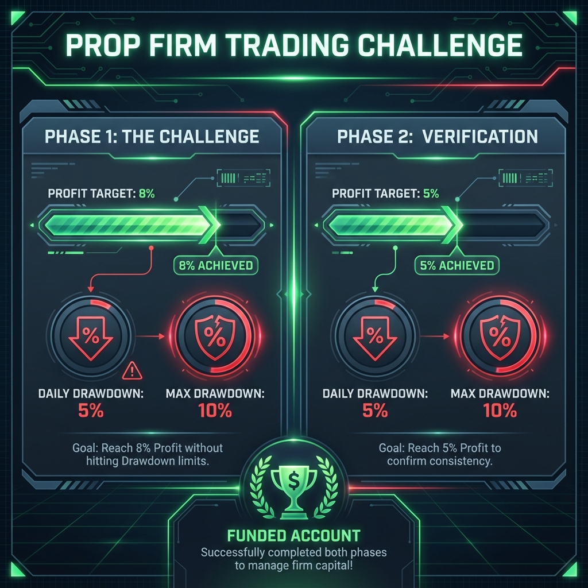

# CHƯƠNG 5: PROP FIRM - KỶ NGUYÊN GIAO DỊCH QUỸ

---

## 1. Prop Firm là gì?

**Proprietary Trading Firm (Prop Firm)** là các công ty cấp vốn cho trader. Bạn không cần bỏ vốn lớn, chỉ cần vượt qua bài thi để được cấp tài khoản giao dịch thật.

### Mô hình hoạt động:

| Bước | Mô tả |
|------|-------|
| 1 | Trader đóng **phí thi** (từ $50 - $1000+ tùy vốn) |
| 2 | Vượt qua **Challenge** (Phase 1 & 2) |
| 3 | Nhận **Funded Account** (tài khoản thật từ $10K - $400K+) |
| 4 | Giao dịch và được **chia lợi nhuận** (80-90%) |

> ⚠️ **Lưu ý:** Rule, sản phẩm được trade, giờ giao dịch, cách tính drawdown… khác nhau giữa các quỹ và có thể thay đổi theo thời gian. Luôn đọc rule chính thức trước khi thi.

---

## 2. Tại sao nên thi Prop Firm?

| Lợi ích | Giải thích |
|---------|------------|
| **Không cần vốn lớn** | Chỉ cần $100-500 để thi tài khoản $50K-$200K |
| **Chia sẻ rủi ro** | Thua = mất phí thi, không mất vốn cá nhân |
| **Thu nhập cao** | Profit 5% của $100K = $5,000, bạn nhận $4,000-4,500 |
| **Kỷ luật** | Quy định của quỹ buộc bạn phải giao dịch có kỷ luật |

---

## 3. Các quy định quan trọng

### Balance vs Equity (cần hiểu trước khi tính drawdown)

| Thuật ngữ | Ý nghĩa |
|----------|--------|
| **Balance** | Số dư sau khi đóng lệnh (không tính lãi/lỗ đang chạy) |
| **Equity** | Giá trị tài khoản hiện tại = **Balance + floating P/L** |

### 🔴 Daily Drawdown (Lỗ tối đa ngày)

| Mức phổ biến | Cách tính |
|--------------|-----------|
| **4-5%** | Dựa trên equity đầu ngày hoặc balance |

**Ví dụ:** Tài khoản $100,000, Daily DD 5%
- Bạn không được lỗ quá **$5,000** trong 1 ngày

#### Daily DD có thể được tính theo nhiều cách
- **Theo balance/equity đầu ngày:** sang ngày mới, “mốc” daily reset.
- **Theo equity cao nhất trong ngày (intraday trailing):** nếu bạn đang lãi trong ngày, mốc lỗ tối đa có thể “dời lên”.

> 💡 Khi thi quỹ, hãy kiểm tra kỹ: drawdown tính theo **balance hay equity**, và lệnh đang mở có được tính vào vi phạm không (thường là có nếu dùng equity).

### 🔴 Max Drawdown (Lỗ tổng)

| Mức phổ biến | Cách tính |
|--------------|-----------|
| **8-12%** | Dựa trên vốn ban đầu hoặc trailing |

**Ví dụ:** Tài khoản $100,000, Max DD 10%
- Equity không được giảm dưới **$90,000**

#### Trailing drawdown (rất quan trọng)
Một số chương trình dùng **trailing max drawdown**: mức “sàn” được kéo lên theo **đỉnh equity/balance**. Điều này khiến việc “giữ lợi nhuận” và tránh trả lại lãi trở nên quan trọng.

### 🟢 Profit Target (Mục tiêu lợi nhuận)

| Phase | Target phổ biến |
|-------|-----------------|
| **Phase 1** | 8-10% |
| **Phase 2** | 5% |

### ⏰ Thời gian

| Loại | Thời hạn |
|------|----------|
| **Minimum Days** | 0-5 ngày (phải trade ít nhất X ngày) |
| **Maximum Days** | 30 ngày - Không giới hạn |

---

## 4. Một số Prop Firm phổ biến (hãy tự kiểm tra tình trạng & rule mới nhất)

| Tên | Đặc điểm | Phí thi (100K) |
|-----|----------|----------------|
| **FTMO** | Lâu đời, uy tín nhất | ~$540 |
| **Funding Pips** | Phí rẻ, nhiều ưu đãi | ~$499 |
| **The5ers** | Instant funding, scale plan | ~$260 |
| **Funded Next** | Express challenge | ~$549 |

> ⚠️ **Lưu ý:** Luôn kiểm tra reviews và payout proof trước khi đóng phí.

---

## 5. So sánh các loại Challenge

### 2-Phase Challenge (Phổ biến nhất)

| Phase | Target | Max DD | Daily DD |
|-------|--------|--------|----------|
| Phase 1 | 8% | 10% | 5% |
| Phase 2 | 5% | 10% | 5% |

### 1-Phase Challenge

| Đặc điểm | Giá trị |
|----------|---------|
| Target | 10% |
| Max DD | 6% |
| Daily DD | 4% |

### Instant Funding

- Không cần thi
- Profit split thấp hơn (50-60%)
- Quy định chặt hơn

---

## 6. Minh họa quản lý rủi ro theo kiểu rule The5ers (ví dụ)

> Đây là **ví dụ minh họa** theo kiểu rule prop firm phổ biến (daily DD, max DD). Rule The5ers có nhiều chương trình khác nhau; hãy đối chiếu rule bạn đăng ký.

### Giả sử rule:
- Vốn: **$100,000**
- Daily DD: **5%** (mốc daily: $5,000)
- Max DD: **10%** (mốc tổng: $10,000)

### Quy đổi ra “R” để dễ trade
Nếu bạn chọn **1R = 0.5%** tài khoản:
- 1R = $500
- Daily DD 5% = 10R/ngày
- Max DD 10% = 20R tổng

Gợi ý thực chiến để “khó bị loại”:
- Rủi ro mỗi lệnh: **0.25%–0.5%** (0.5R–1R)
- Dừng ngày khi lỗ **-2R đến -3R**
- Tổng rủi ro lệnh đang mở ≤ **2R–3R**

### Ví dụ một ngày giao dịch
- Bạn vào 3 lệnh, mỗi lệnh 0.5R (0.25%).
- Kết quả: -0.5R, +1R, -0.5R ⇒ tổng = **0R** (hòa vốn) và bạn vẫn còn “dư địa” rất xa so với daily DD.

> 💡 Điểm mấu chốt khi thi quỹ là **không vi phạm rule**, không phải “ăn target thật nhanh”.

---

## 7. Những điều CẤM trong Prop Firm

| Điều cấm | Hậu quả |
|----------|---------|
| **Martingale** | Vi phạm, mất tài khoản |
| **Grid trading** | Vi phạm quy định |
| **News trading** (một số quỹ) | Lệnh bị hủy hoặc mất acc |
| **Copy trade từ người khác** | Vi phạm |
| **Giữ lệnh qua cuối tuần** (một số quỹ) | Lệnh bị đóng tự động |
| **Trade tin NFP, FOMC** (một số quỹ) | Profit không được tính |

---

## 8. Tips khi thi Prop Firm

| Tips | Giải thích |
|------|------------|
| **Đọc kỹ rules** | Mỗi quỹ có quy định khác nhau |
| **Trade như thật** | Đừng ép target, trade bình thường |
| **Chia nhỏ rủi ro** | 0.25-0.5% mỗi lệnh thay vì 1-2% |
| **Không FOMO** | Chỉ vào lệnh khi có setup đẹp |
| **Bảo vệ tài khoản** | Mục tiêu là không bị loại, không phải thắng nhanh |

### Checklist nhanh trước khi vào lệnh (thi quỹ)
1. Lệnh này có vi phạm rule không? (news/weekend/size/EA/copy…)
2. SL ở đâu (invalidation)? Rủi ro = bao nhiêu % / bao nhiêu R?
3. R:R tối thiểu (ví dụ ≥ 1:2) và TP ở vùng nào?
4. Nếu thua lệnh này, hôm nay còn được trade không (theo daily stop)?
5. Tổng rủi ro lệnh đang mở có vượt giới hạn của bạn không?

## 📝 Bài tập Chương Prop Firm (Test kiến thức)

1. **Khái niệm:** Daily Drawdown là gì? Khác gì so với Max Drawdown?
2. **Tính toán:** Tài khoản $50,000, Daily DD 5%. Bạn được phép lỗ tối đa bao nhiêu USD trong ngày?
3. **Tính toán:** Tài khoản $50,000, Max DD 10% (không trailing). Equity tối thiểu được phép là bao nhiêu USD?
4. **Quy tắc:** Minimum Trading Days nghĩa là gì? Vì sao quỹ đặt quy định này?
5. **Phân biệt:** 2-phase challenge khác gì 1-phase challenge (về target và drawdown)?
6. **Trailing DD:** Trailing max drawdown là gì? Vì sao nó “khó” hơn drawdown cố định?
7. **Ví dụ theo kiểu The5ers:** Với tài khoản $100,000, Daily DD 5% và bạn chọn 1R = 0.5%. Daily DD tương đương bao nhiêu R?
8. **Quản lý rủi ro:** Nếu bạn đang thua -2R trong ngày và rule cá nhân là stop day tại -2R, bạn nên làm gì?
9. **Tổng rủi ro mở:** Nếu giới hạn tổng rủi ro lệnh đang mở là 3R, bạn đã có 2 lệnh rủi ro 1R và 1.5R. Bạn còn được mở tối đa bao nhiêu R?
10. **Cấm:** Nêu ít nhất 3 hành vi thường bị cấm/không khuyến khích trong prop firm và hậu quả có thể gặp.
11. **News rule:** Nếu quỹ cấm news trading trong 5 phút trước/sau tin mạnh, bạn nên xử lý lệnh đang mở thế nào?
12. **Tâm lý:** Vì sao “ép target” thường khiến fail challenge? Nêu 2 dấu hiệu bạn đang ép target.
13. **Due diligence:** Trước khi mua challenge, bạn cần kiểm tra tối thiểu 5 mục gì? (gợi ý: payout, rule, sản phẩm, spread/commission, nền tảng…)
14. **Kịch bản vi phạm:** Bạn đang lãi +3% nhưng mở thêm lệnh lớn khiến rủi ro tổng vượt Daily DD. Sai ở đâu và sửa thế nào?

## ✅ Đáp án gợi ý (Prop Firm)

1. **Đáp án:** Daily DD = giới hạn lỗ **trong ngày**; Max DD = giới hạn lỗ **toàn tài khoản**. Daily thường reset theo ngày (tùy cách tính), Max thường không reset.
2. **Đáp án:** 5% × $50,000 = **$2,500**.
3. **Đáp án:** Equity không được < $50,000 × (1 - 0.10) = **$45,000**.
4. **Đáp án:** Minimum Trading Days = phải trade ít nhất X ngày để pass. Quỹ đặt để hạn chế việc “all-in 1 ngày” và đánh giá tính ổn định.
5. **Đáp án:** 2-phase thường target chia 2 giai đoạn (ví dụ 8% rồi 5%) và giữ DD tương tự; 1-phase thường target 1 lần nhưng DD có thể chặt hơn (tùy quỹ).
6. **Đáp án:** Trailing max DD là “sàn” drawdown **dời theo đỉnh equity/balance**. Khó hơn vì bạn có thể bị loại dù đang có lãi nếu trả lại lợi nhuận quá nhiều (tùy rule).
7. **Đáp án:** Daily DD 5% = 10 lần 0.5% ⇒ **10R/ngày**.
8. **Đáp án:** **Dừng giao dịch trong ngày** theo rule cá nhân; review lại lệnh/thói quen; tránh “gỡ” vì dễ vi phạm DD.
9. **Đáp án:** Đang mở 2.5R ⇒ còn **0.5R**.
10. **Đáp án (ví dụ):** Martingale, grid, copy trade trái phép, vi phạm news/weekend rule, dùng EA bị cấm… Hậu quả: lệnh bị hủy, không tính profit, hoặc mất tài khoản.
11. **Đáp án (gợi ý):** Giảm/đóng bớt vị thế trước thời điểm cấm; tránh mở lệnh mới; nới SL tùy tiện là sai—tốt nhất tuân theo plan và rule quỹ.
12. **Đáp án (gợi ý):** Ép target làm tăng rủi ro và mất kỷ luật. Dấu hiệu: tăng lot bất thường; vào lệnh ngoài setup; trade quá nhiều để “kiếm cho đủ %”.
13. **Đáp án (gợi ý):** Rule DD (daily/max, trailing), news/weekend, sản phẩm được trade, spread/commission, nền tảng & server, payout proof & lịch payout, profit split, chính sách refund, quy định EA/copy, minimum days.
14. **Đáp án (gợi ý):** Sai ở chỗ ưu tiên “kiếm nhanh” hơn bảo vệ tài khoản; cần giảm rủi ro mỗi lệnh, giới hạn tổng rủi ro mở (2–3R), và dừng khi gần chạm DD.

---

**[⬅️ Chương trước](./chuong_4_quan_ly_rui_ro.md)** | **[Mục lục](./README.md)**
